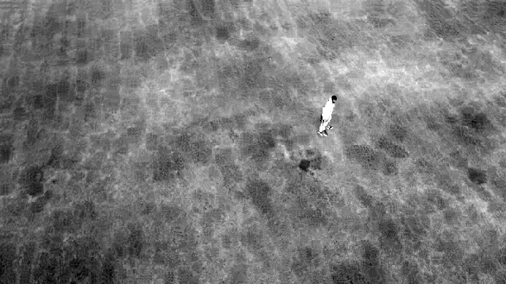
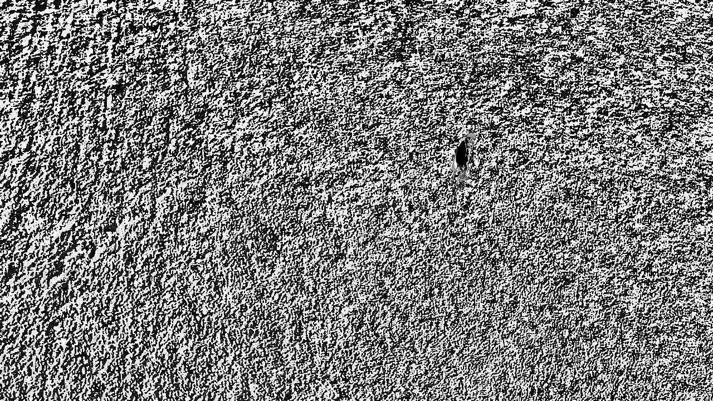

# 3 Step Search Block Matching Algorithm
3 Step Search Block Matching Algorithm found in compression codecs such as H.264 implemented in Python.

To run the 3 Step Search Block Matching Algorithm on two frames, run main() in main.py. 

If you want to run the 3 Step Search Block Matching Algorithm on a video and graph the residual metric (quantifies the change across frames), run graphSession() in analytics.py.

##### This is the target frame we are trying to predict using block matching.
 

##### This is the predicted frame achieved using block matching.
 

##### Subtracting the target and predicted frames produces the residual frame. This is the small amount of data that was not captured by the predicted frame and must be encoded during the compression process.
 

##### This is the naive residual frame achieved with no block matching. Clearly most data was not captured; all this information must be encoded and thus shows the power of block matching.
 

##### This is the predicted frame added to the residual frame. It perfectly reconstructs the target frame as expected.

 

##### Compute the residual metric across a video to visualize the parts of the video that change the most. The residual metric is computed from the mean absolute difference of the residual frame.

#### How Effective is Compression?
Consider a 1920x1080 pixel frame = 2,073,600 pixels.
If video is 30 fps = 62 million frames per second = w each pixel @ 3 bytes = 177 MB per second 
Thus a 5 minute video is 51 GB of data, but with compression it is 72 MB

#### Types of Compression:
Compression works by minimizing redundancy in the video data
* **Spatial Compression (Intraframe)** ex. JPEG - Applied on individual frames (uses chroma subsampling, and image is split into 8x8 pixel sections called macroblocks, then following keywords are applied to reduce file size: discrete cosine transform, quantizing, entropy encoding)
* **Temporal Compression (Interframe)** ex. MPEG, breaks video into 8x8 pixel macroblocks, each macro block receives instructions on what to do with their pixels, video frames with instructions are P-Frames, P-Frames use 1/2 as much date as I-Frames (JPEGs), B-Frames (use 1/4 as much data as I-Frame) are interpolations (predictions) between I and P Frames
* **Codecs:** Codecs are standards that describe how compression is performed. For videos there is H.264, H.265, and MPEG-2/4 Standards. H.264 is widely used (ex. by Youtube). H.264 and H.265 are protected by patents (H.264 is now open sourced by Cisco https://github.com/cisco/openh264). Google presented open source (and free) VP8 and VP9 codecs, Which is what Netflix uses. MP4/MOV are containers that do not have any content, it holds the video stream (ex. H.264), audio stream (ex. mp3, sac, ogg), and metadata (titles, year, etc).

#### H.264 Codec for Videos:
* Splits image into blocks of 256 pixels each.
* Codec predicts what each block will look like based on current and previous frames
* Compares predicted block to actual block, creating a difference called a residual
* Residual is compared to 16 checker-board like patterns, how much each pattern contributes is stored as a number, higher frequency patterns are often discarded (thus **lossy compression**)
* H.264 codec takes half as much space as MPEG-2 
* H.264 identifies when something in the last frame is still visible. It can encode panning, rotating, zooming, tilting, stretching+warping etc. H.264 uses lossy compression (in lossy compression some data is lost, no data is lost during lossless compression).

#### What Parameters to Consider during Encoding:
* There are 3 things to consider: Performance, File Size, and Quality.
* You can control how H.264 encoded using the parameters Preset / CRF or Bitrate.
* **Preset** determines how much processing power will be used to encode the video, faster processing means larger video size.
CRF stands for constant rate factor, it is between 0-51, 0 is lossless (huge file size), 51 is trash, increase of 6 CRF will roughly double file size, recommended number is between 14 (better quality, more processing power to encode)-24 (smaller file size).
* **Bitrate** specifies number of kilobits per second in data stream, and thus the file size. Bitrate is usually around 2000-6000 kbps, GoPro video runs at 30,000 kbps.
* **When encoding, choose Bitrate for streaming and CRF for recording to hard drive/SSD**
* I-Frames are encoded without reference to other frames (also called Key Frames), recommend a key frame every 10 seconds ie. Every 300 frames in 30fps video.
* Recommended B-Frames between I and P frames is 3, Recommended Reference Frames (Frames in which B-Frames can find redundancies) is 5

#### Steps in H.264 Compression: (Processes are inversed to decode image data for viewing)

* Like MPEG-2/4 before it, H.264 also uses block-based encoding. This means that H.264 employs motion estimation, transform, quantization, and entropy encoding to compress video, and it inverses these processes to decode image data for viewing.

* H.264 reveals itself as the up-and-coming superior standard through its streamlining of motion estimation with variable block sizes, quarter pixel resolution, and in loop deblocking as well as its advancements in variable-length encoding.

1. **Motion Estimation (most influential step for efficient encoding):** determines the rate of change in a frame compared to its reference frame. Another aspect of motion estimation is the process of motion compensation, during which the difference or change between the macroblocks is calculated. Motion compensation and the creation of motion vectors transpire concurrently in motion estimation to select the best block size, calculate the difference (residual), and generate motion vectors for every quarter pixel to reduce the residual difference between image frames, ultimately making H.264 encoders extremely efficient.
* **Variable Block Sizes:** While MPEG-2/4 uses blocks containing 8x8 pixels, H.264 allows block sizes to vary to include block sizes of 16x16, 16x8, 8x16, 8x8, 8x4, 4x8, or 4x4 pixels. This is more efficient.
* **Quarter-Pixel Resolution:** The direction in which reused pixels should shift in the following frame or field (either vertically or horizontally) is identified through motion vectors to indicate how to best situate data. H.264 generate motion vectors using quarter-pixel resolution to accurately arrange data (MPEG-2/4SP use half-pixel increments). 

2. **Transform:** Motion estimation is described using the Discrete Cosine Transformation (DCT) method that encodes the residual into a matrix. This method uses lossy compression.

3. **Quantization:** The transform coefficients are divided by a dynamic Q value, used to manage the size of the bit stream, and then discarding trivial coefficients in a specified value range by reducing them to zero. In scalar quantization, values within a predetermined range around zero are inconsequential and reduced to zero. This lowers the bit rate without impacting the perceived quality of the image.

4. **Entropy Encoding:** Recommended is CABAC (context-adaptive binary arithmetic coding) Instead of CAVLC (context-adaptive variable-length coding). The final step that reduces the Transform matrix into 0s and 1s, improving efficiency.

#### References:

##### H.264 Standard Overview:
* [H.264 Video Compression Standard For Video Compression: Improvement Or Buzzword?](https://www.securityinformed.com/insights/co-1260-ga.5354.html)
* [Motion Estimation In H.264 Video Compression | Security News](https://www.securityinformed.com/insights/co-1260-ga.5355.html)
* [Understanding Transform, Quantisation And Entropy Encoding In H.264 Video Compression](https://www.securityinformed.com/insights/co-1260-ga.5356.html)

##### Motion Estimation and Related Content:
* [Wikipedia: Motion Compensation](https://en.wikipedia.org/wiki/Motion_compensation#MPEG)
* [Image and Video Compression ](https://www.tcs.ifi.lmu.de/teaching/ws-2016-17/code/background-image-video-compression)
* [The H.264 Advanced Video Compression Standard, Second Edition](http://last.hit.bme.hu/download/vidtech/k%C3%B6nyvek/Iain%20E.%20Richardson%20-%20H264%20(2nd%20edition).pdf)
* [Video Coding Walkthrough](https://www.vcodex.com/video-coding-walkthrough/)
* [Discrete Cosine Transform (Algorithm and Program)](https://www.geeksforgeeks.org/discrete-cosine-transform-algorithm-program/)
* [Video File Formats - MP4, MOV, MKV](https://www.youtube.com/watch?v=hvgxn8v--8Q)
* [H.264/MPEG-4 AVC Video Compression Tutorial](http://web.cs.ucla.edu/classes/fall03/cs218/paper/H.264_MPEG4_Tutorial.pdf)

##### Other Slightly Related Image Differentiation Techniques
* [Introduction to Motion Estimation with Optical Flow](https://nanonets.com/blog/optical-flow/)
* [Optical Flow Python Example](https://www.youtube.com/watch?v=QwmADw_MUig)
* [Image Matching Using SIFT, SURF, BRIEF and
ORB](https://arxiv.org/pdf/1710.02726.pdf)

#### Notable Articles:
* [The H.264 Advanced Video Compression Standard, Second Edition](http://last.hit.bme.hu/download/vidtech/k%C3%B6nyvek/Iain%20E.%20Richardson%20-%20H264%20(2nd%20edition).pdf) (BEST Video Compression Guide, No Code included)
* [Motion Estimation for Video Coding](https://web.stanford.edu/class/ee398a/handouts/lectures/EE398a_MotionEstimation_2012.pdf) (Stanford Slideshow)
* [Debug/MacroblocksAndMotionVectors](https://trac.ffmpeg.org/wiki/Debug/MacroblocksAndMotionVectors) (FFMPEG Motion Vector Visualization)
* [A hands-on introduction to video technology: image, video, codec (av1, vp9, h265) and more (ffmpeg encoding).](https://github.com/leandromoreira/digital_video_introduction) (Compression Overview)
* [H.264 implementation on FFMPEG](https://www.ffmpeg.org/ffmpeg-codecs.html#libopenh264)
* [Open Source H.264 Source Code](https://github.com/cisco/openh264)

The 4 main steps to compression is motion estimation, transform, quantization, and entropy encoding.

Motion estimation is the step that allows us to quantify a residual between an I-Frame and a P-Frame. We would like to retrieve a residual computed across the temporal dimension ie. from interframe compression for our HYDRA research. The better the motion estimation algorithm, the smaller the residual. 

If I were to recommend one article to understand intraframe and interframe video compression, it would be **Chapter 6** of [The H.264 Advanced Video Compression Standard, Second Edition.](http://last.hit.bme.hu/download/vidtech/k%C3%B6nyvek/Iain%20E.%20Richardson%20-%20H264%20(2nd%20edition).pdf)

Chapter 2 (background information) discusses how an RGB image is converted to the YCrCb color space. Our eyes are more sensitive to luminance (Y component) than chroma (Cr/Cb components). To reduce image density, the Cr and Cb components are sampled across a larger set of pixels. Figure 2.11 displays the 4:2:0, 4:2:2 and 4:4:4 sampling patterns. 

Chapter 6 discusses intraframe and interframe compression. 

* **Intraframe compression** is conducted by dividing a frame into macroblocks of 16x16 pixels (or 4x4 pixels, etc), and encoding each macroblock based on the pixels directly above and directly to the left of the current macroblock. 8 encoding patterns (See Figure 6.12) are applied and the pattern with the smallest SAE (Sum of Absolute Errors) is chosen. The Luma and Chroma elements have the above action performed separately. 

* **Interframe compression** deals with I-Frames, P-Frames, and B-Frames. I-Frames encode all information. P-Frames are predicted frames based off of the previous I-Frame. To compute a P-Frame of the current frame, the current frame is divided up into macroblocks. Each macroblock is compared to the pixels within a similar search area on the I-Frame. Once a macroblock-sized area is found on the I-Frame that minimizes the SAE, the motion vector is computed on where to move the I-Frame macroblock to its allocated spot on the P-Frame. This is known as a **block-matching algorithm**. Once this is achieved for all macroblocks of the current frame, then we have finished computing the predicted frame of the current frame. To get the motion compensated residual we just subtract the current frame from the predicted frame. As mentioned before, **the better the motion estimation algorithm, the smaller the residual.** 

There are several block-matching algorithms. They are the following: **Exhaustive Search, Three Step Search, Diamond Search, Four Step Search and Adaptive Road Pattern Search.** Here are links to learn more about the various block matching algorithms:

* [Wikipedia: Block-Matching Algorithms](https://en.wikipedia.org/wiki/Block-matching_algorithm)
* [Analysis of Block Matching Algorithms for Motion Estimation in H.264 Video CODEC](https://www.researchgate.net/publication/269571651_Analysis_of_Block_Matching_Algorithms_for_Motion_Estimation_in_H264_Video_CODEC)
* [Block Matching Algorithms for Motion Estimation MATLAB Implementation](https://www.mathworks.com/matlabcentral/fileexchange/8761-block-matching-algorithms-for-motion-estimation)
* [Exhaustive Search Python Implementation](https://github.com/javiribera/frame-block-matching/blob/master/ebma_searcher.py)

#### Code Implementation:
In order to compute the residual frame I must compute the P-Frame with respect to an I-Frame. The residual metric implementation is revamped to compute the Residual Frame in 0.4 seconds (for  360p images, 2 seconds for 720p) on the luma component of both the I-Frame and Current Frame using a custom implementation of the 3 step search block matching algorithm. The residual metric is computed from the Mean Absolute Difference of the Residual Frame.
